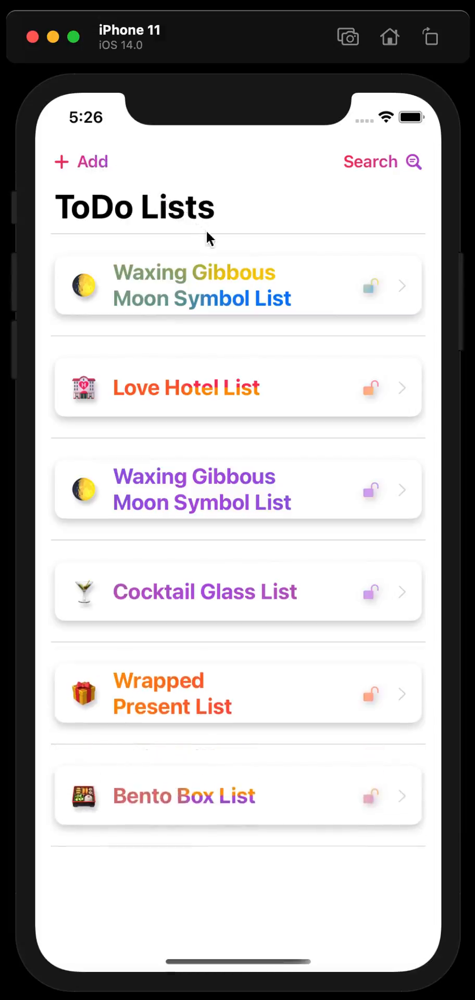
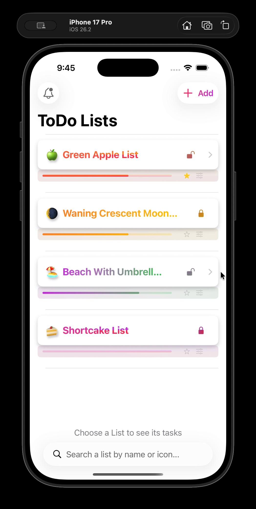
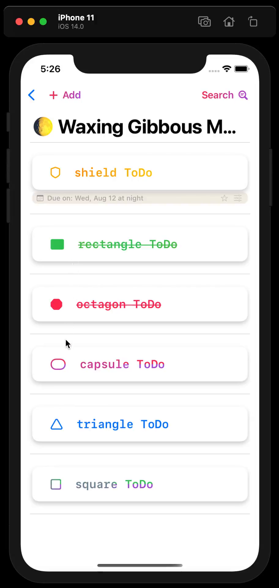
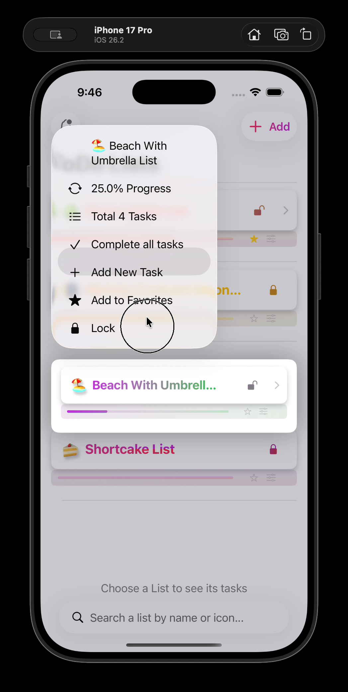

# ToDo-SwiftUI 📱

A modern, feature-rich ToDo list app built with SwiftUI featuring beautiful gradient themes, biometric authentication, and a sleek Liquid Glass design.

## Features

- **📋 Multiple Lists** - Create and manage multiple ToDo lists with custom icons and colors
- **🎨 Custom Themes** - Choose from gradient color schemes (linear, radial, angular)
- **🔐 Biometric Lock** - Protect sensitive lists with Face ID/Touch ID
- **⭐ Favorites** - Mark lists as favorites for quick access
- **📊 Progress Tracking** - Visual progress bars show task completion
- **🔍 Search** - Quickly find lists and tasks with native search
- **📱 Widgets** - Home screen widgets to view your tasks at a glance

## Side-by-Side Evolution

### Animation Comparison (2020 vs 2026)

| Original iOS 14 (2020) | Revamped iOS 26 (Liquid Glass) |
| :---: | :---: |
|  |  |

### Design Comparison (Static)

| Feature | iOS 14 (Standard) | iOS 26 (Liquid Glass) |
| :--- | :---: | :---: |
| **Main View** |  |  |
| **Detail View** |  |  |

*The app has evolved from a simple iOS 14 ToDo list to a premium iOS 26 Liquid Glass experience.*

*App running on iPhone 17 Pro Simulator with iOS 26 Liquid Glass*

## Requirements

- iOS 16.0+
- Xcode 15.0+
- Swift 5.9+

## Installation

1. Clone the repository
2. Open `ToDo-SwiftUI.xcodeproj` in Xcode
3. Build and run on your device or simulator

## Architecture

The app uses modern SwiftUI patterns including:
- `NavigationStack` with value-based navigation
- `@Observable` and `@ObservedObject` for state management
- Native `.searchable` modifier for search functionality
- `.toolbar` for navigation bar items
- Native `ColorPicker` for color selection

---

## 🔄 Migration Note

> This app was **originally written in 2020** targeting **iOS 14** using the SwiftUI framework available at that time.
>
> In **January 2026**, it was **revamped to iOS 26 Liquid Glass** design language using **vibecoding** on **Google Antigravity IDE** powered by **Claude Opus 4.5**.

### Key Modernizations

| Original (iOS 14) | Revamped (iOS 26) |
|-------------------|-------------------|
| `NavigationView` | `NavigationStack` |
| `NavigationLink(destination:isActive:)` | `NavigationLink(value:)` |
| `.navigationBarItems()` | `.toolbar { }` |
| Custom `SearchBar` view | Native `.searchable()` |
| Custom wheel picker | Native `ColorPicker` |

---

## License

MIT License

## Author

Created by Saumil Shah
